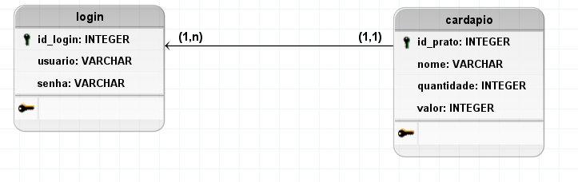
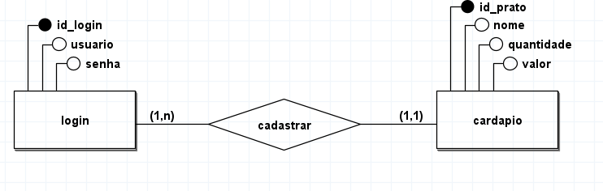

# Restaurante 🍽️

**Restaurante** é um sistema simples para gerenciamento de pratos de um restaurante. O administrador pode cadastrar novos pratos, enquanto os clientes podem visualizar a tabela de pratos disponíveis para escolha.

## 📋 Funcionalidades

### Para Administradores:
- **Cadastro de Pratos:**  
  O administrador pode cadastrar novos pratos no menu, incluindo nome, descrição e preço.
- **Gestão de Pratos:**  
  O administrador tem a capacidade de editar ou excluir pratos existentes.

### Para Clientes:
- **Visualização de Pratos:**  
  Os clientes podem visualizar a lista completa de pratos disponíveis no menu.
- **Informações Detalhadas:**  
  Cada prato vem com informações como nome, descrição e preço.

## 🛠️ Tecnologias Utilizadas

- **Frontend:**  
  - HTML5  
  - Tailwind CSS  
- **Backend:**  
  - PHP  
- **Banco de Dados:**  
  - MySQL  

## 🗂️ Modelagem do Banco de Dados

